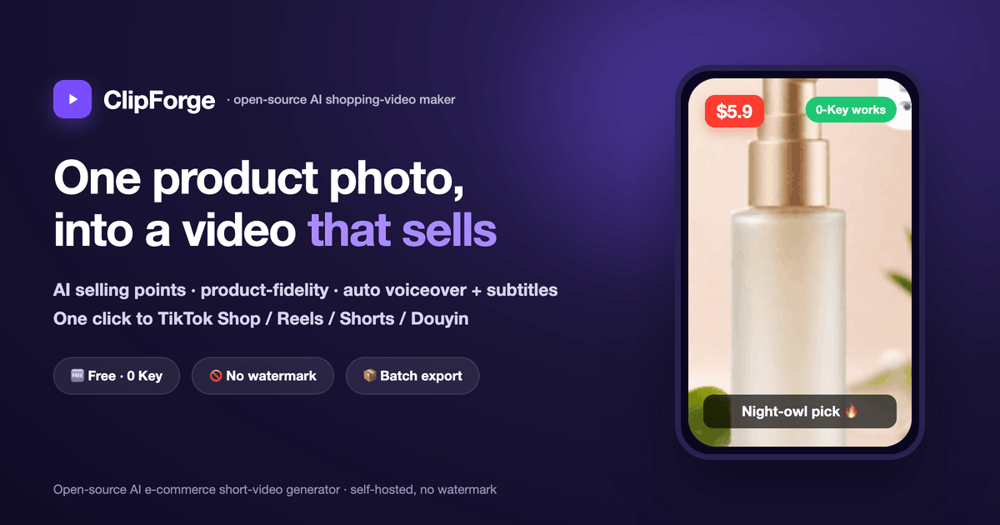
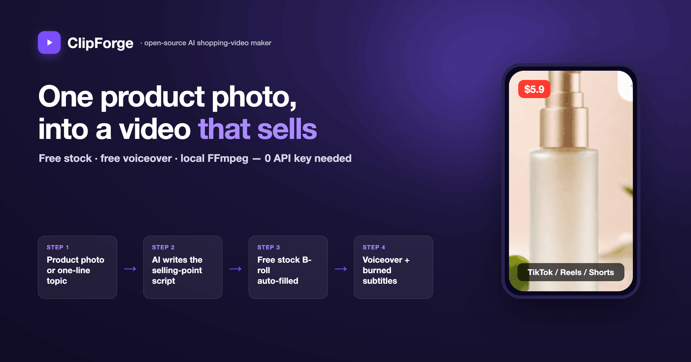
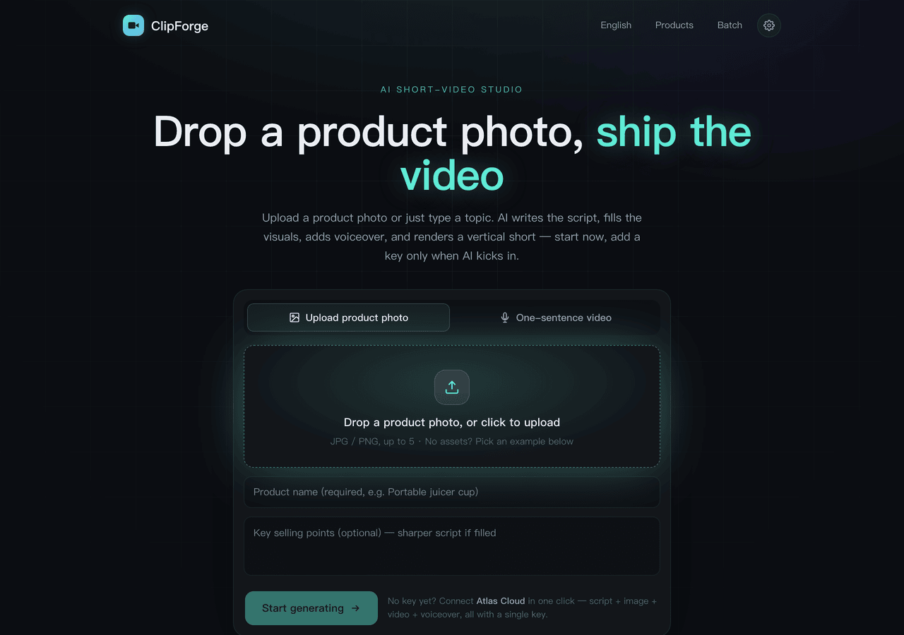
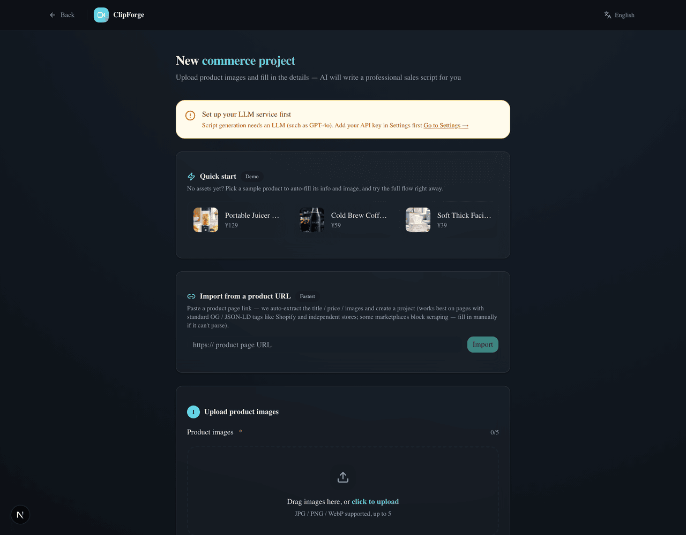
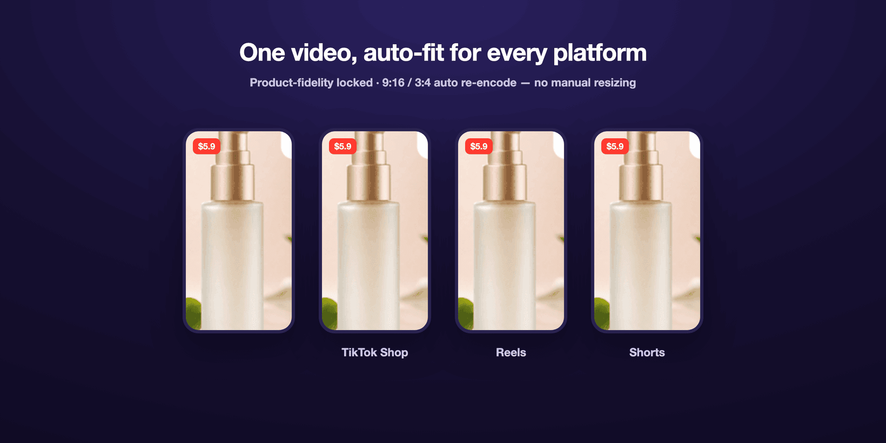

<p align="center"></p>

# ClipForge — Open-source AI shopping-video maker ｜ One product photo, an auto-generated video that sells

> **Turn one product photo into a short video that actually converts.** Upload a product image → AI extracts selling points · writes the script · **locks your product so it never gets distorted** · adds voiceover + subtitles + BGM → in tens of seconds you get a video ready to post to **TikTok Shop / Reels / Shorts / Douyin / Kuaishou / Xiaohongshu**. **One person, dozens of videos a day · 0-cost batch production · open-source, no watermark.**
>
> <sub>📌 Formerly『**带货剪手** / daihuo-jianshou』— repo · stars · history all carried over; also does "one-sentence topic → video" for any non-commerce subject.</sub>

<p align="right"><strong>English</strong> · <a href="README.md">中文</a></p>

<p align="center">
  
  
  
  
  
  
  
  
</p>

## 🛍️ Not just another AI video tool — **built for selling**

There's no shortage of AI short-video tools, but most can't really sell: **they don't extract selling points, don't understand platform algorithms, and they distort your product beyond recognition.** ClipForge was designed for **conversion** from day one:

- 🎯 **Product fidelity (the make-or-break for commerce)**: image-to-image locks your original product; you can swap the background or relight it **without altering the product itself** — your product never gets "Photoshopped wrong."
- 🧲 **Scripts that sell**: 5 deep category templates × 4 selling styles (pain-point / scenario / comparison review / storyline) + a **golden-3-seconds hook library** — not a dry spec readout.
- 📈 **Algorithm-aware**: auto-generates hashtags / cover copy / engagement prompts tuned to **TikTok / Reels / Shorts / Douyin / Kuaishou / Xiaohongshu** and their in-app shopping carts.
- 📦 **Batch + viral remix**: pick 10 products and batch-render before a big sale, save winning scripts as templates, paste a competitor link to **re-shoot with your own product**, and A/B multiple cuts to test conversion.

## 🆓 And it batches videos at zero cost

- **Truly free, zero-key**: free stock assets (Openverse images + **Wikimedia real footage**) + free Microsoft Edge TTS voiceover (Chinese / English / Japanese / Korean / Spanish — native pronunciation for going global) + free background music + local FFmpeg compositing — **you can render a full video without any AI key.**
- **No watermark · local & private**: self-hosted, open-source (AGPL-3.0). Your product images / projects / keys all stay on your own machine — nothing is uploaded to any cloud.
- **Add a key for higher quality**: one interface aggregates **7** image/video platforms and 30+ models (GPT Image 2 / Seedance 2.0 / Kling 3.0 …).
- **Callable by AI agents**: a built-in **MCP Server** lets you make a video with one sentence in Claude / Cursor; bilingual UI (中文 / English).

## 🎬 Two ways to use it (commerce-first, but any subject works)

- **🛍️ Product commerce video (main use case)**: **upload a product photo, or just paste a product URL** (it auto-extracts title/price/images) → AI extracts selling points and writes several sales scripts → your original product appears with fidelity + free stock B-roll → free voiceover + subtitles + BGM → one-click export in TikTok Shop / Reels / Shorts / Douyin / Kuaishou / Xiaohongshu specs.
- **🗣️ One-sentence topic video**: works even when you're not selling — type a one-line topic, AI writes the narration → free stock auto-fills the visuals (incl. key-free real footage) → free voiceover → renders a vertical short.
- **✅ Compliance + conversion switches**: **dual AIGC labeling** — burn an explicit "AI-generated" overlay on-frame + write implicit file metadata (generation/synthesis tags, service provider, content ID, aligned with China's GB 45438-2025), to avoid the silent throttling platforms apply to "unlabeled AI content"; plus an end-card "tap the cart below" CTA. The script side also **pre-flags ad-law risk terms** (absolute claims / false efficacy / medical wording) and annotates the script page with fixes before you render.
- **🛒 Product-card overlay (cart feel)**: optionally overlay a product card in the lower-left — thumbnail + name + a yellow "tap below to buy →" prompt, shown for the first few seconds to reinforce conversion.
- **📋 Copy-and-post pack**: the export page generates catchy titles + #hashtags + caption copy in one click; even without an AI key, a **key-free template version** outputs per category/platform — just copy and post.

<p align="center"></p>

## 💡 In practice: one product photo → a video in 30 seconds

Using the sample "Soft Thick Facial Tissue":

1. **Upload & name** — upload the product photo, fill in the name, pick platforms (TikTok / Reels / Shorts / Douyin).
2. **AI writes the script (~30s)** — outputs 3 sales scripts (pain-point / scenario / comparison) with golden-3-seconds hooks, hashtags, cover copy, and engagement prompts.
3. **Fill the visuals** — your product appears **with fidelity** + the free stock library auto-fills lifestyle B-roll (no AI key burned).
4. **Auto-render** — auto voiceover + burned subtitles + price tag + background music, composited for real by FFmpeg.
5. **One-click export** — toggle 9:16 / 3:4, post to your shop, and start selling.

> The whole thing is **fully automated, watermark-free**; before a big sale you can pick 10 products to **batch-render**, apply viral templates, and A/B multiple cuts.

**Keywords**: AI shopping video · short-video ad maker · e-commerce short video · product-to-video · faceless UGC ads · TikTok Shop / Reels / Shorts / Douyin / Kuaishou / Xiaohongshu · AI selling-point extraction · batch rendering · viral remix · product video generator · AI voiceover · open-source self-hosted · MCP · GPT Image 2 / Seedance 2.0

---

## UI preview

| Home · drop a photo, ship the video | New project · paste a URL or upload |
|:---:|:---:|
|  |  |

<p align="center"></p>

---

## 🆚 Making a shopping video: traditional outsourcing vs ClipForge

| Pain point | Traditional way | ClipForge |
|------|---------|---------|
| **Scriptwriting** | Director writes for 1–2 hours | AI generates 3 scripts in 30s |
| **Asset creation** | Shoot + retouch, 1–3 days | AI image/video, render in minutes |
| **Video editing** | Editor, 2–4 hours | Auto compositing + transitions + subtitles + voiceover |
| **Multi-platform** | Manually adjust ratio/subtitles | One-click export TikTok / Reels / Shorts / Douyin |
| **Batch output** | 3–5 videos a day at most | Pick 10 products, batch in one click |
| **Cost** | Director + shoot + edit, thousands per video | API cost, cents to a few dollars per video |

> 💡 The free path (free stock + free voiceover + local compositing) **costs $0**; you're only billed (a few dollars per video) when you opt into paid AI image/video models.

---

## ❓ FAQ

**What is ClipForge?**
ClipForge (formerly 带货剪手 / daihuo-jianshou) is an **open-source, free AI shopping-video tool**: upload one product photo and AI extracts selling points, writes a sales script, **keeps your product undistorted**, fills visuals + voiceover + subtitles, and outputs a TikTok Shop / Reels / Shorts / Douyin / Kuaishou / Xiaohongshu video in one click; it also does "one-sentence topic → video" for any non-commerce subject.

**Is it really free? Do I need an API key?**
The free path is **0-key**: assets from free commercial-use CC libraries (Openverse images + Wikimedia real footage), voiceover from free Microsoft Edge TTS, compositing from local FFmpeg. You only need a key for the platform you choose when you want paid AI image/video models.

**Can it make commerce / e-commerce shorts?**
Yes. Upload a product photo and AI analyzes selling points, writes multiple sales scripts, **keeps the product undistorted**, and exports TikTok Shop / Reels / Shorts / Douyin / Kuaishou / Xiaohongshu specs in one click.

**Is there a watermark? Can I use it commercially?**
No watermark. Self-hosted + open-source (AGPL-3.0); output is clean and commercially usable (third-party assets follow their own licenses; exports can include attribution credits).

**How is it different from CapCut / commercial AI video SaaS?**
ClipForge is **open-source, runs locally, no watermark, zero-cost on the free path, and your data never leaves your machine**; commercial SaaS usually charges per video, watermarks output, and requires uploading assets to the cloud.

**Can I use it if I can't write scripts or edit?**
Yes. The whole flow is automatic — AI writes the script, fills visuals, adds voiceover, burns subtitles, adds transitions. **No on-camera presence, no shooting, no editing.**

**Which platforms and languages are supported?**
One-click fit for TikTok / Reels / Shorts (9:16) / Douyin / Kuaishou / Xiaohongshu (3:4); the UI and docs support **中文 / English**, auto-switching by system language.

**Can an AI assistant (Claude / Cursor) generate videos directly?**
Yes. ClipForge ships an **MCP Server** — one sentence in an MCP-capable client drives a render. See [mcp/README.md](mcp/README.md).

---

## Core features

### 1. AI sales-script generation

- **5 deep category templates**: beauty & skincare / food & snacks / home & daily / fashion & apparel / digital & 3C
- **4 script styles**: pain-point / scenario / comparison review / storyline
- **Golden-3-seconds library**: visual shock / suspense question / sharp contrast / benefit promise / emotional resonance
- **Platform SEO**: auto-generates hashtags, cover copy, engagement prompts tuned to TikTok / Reels / Shorts / Douyin / Kuaishou / Xiaohongshu algorithms
- **Precise targeting**: set the target audience, price range, and platforms — the script matches automatically

### 2. AI asset generation (multi-model aggregation)

One interface aggregates 7 image/video platforms + OpenRouter LLMs and 30+ mainstream models:

| Platform | Image models | Video models | Highlights |
|------|---------|---------|------|
| **Atlas Cloud** ⭐ recommended | **GPT Image 2**, Seedream 5.0, Nano Banana 2 | **Seedance 2.0** (native audio), Kling 3.0, Vidu Q3 | One key for LLM + image + video; widest models, best price |
| **fal.ai** | **GPT Image 2** (+edit), FLUX.1/2 Pro, Recraft V4, Seedream V5 Edit | Kling 3.0 Pro, Veo 3, Hailuo 2.3, Luma Ray 2, Vidu Q2 | Broad model set, incl. OpenAI image gen & product-fidelity edit |
| **Replicate** | FLUX 1.1 Pro/Kontext, Imagen 4, Seedream 4 | Kling v2.1, Seedance 1 Pro, Hailuo 02, Veo 3 Fast | Largest model library, unified predictions API |
| **Volcengine (Ark)** | Seedream 5.0/4.0 | Seedance 2.0/1.0 Pro (native audio) | ByteDance flagship models, cinematic quality, fast |
| **Alibaba Bailian** | Tongyi Wanxiang | Wanxiang 2.6/2.5/2.2/2.1 | Strong product image-to-video |
| **SiliconFlow** | Kolors, Qwen-Image | - | Cost-effective, China-made |
| **OpenAI** | **gpt-image-2** (any resolution + image edit), gpt-image-1.5 | - | 2026 flagship image model, strong text rendering, native 9:16, product-fidelity edit |

> **LLM (script generation)** uses the OpenAI-compatible protocol, with built-in presets for Atlas Cloud / **OpenRouter** (400+ models) / DeepSeek / Kimi / Zhipu / Doubao / OpenAI.

### 3. Multi-source free asset engine 🆕 (not just AI generation)

One English search term pulls video/image/music from multiple **free commercial-use** asset sites, auto-downloading, storing, and keeping compliance attribution — so you can fill every shot even without a product photo and without burning AI credits:

| Source | Key-free | Media | Notes |
|--------|:---:|------|------|
| **Openverse** | ✅ | image / music / SFX | Maintained by WordPress, CC-licensed, **zero-config** (best for beginners) |
| **Wikimedia Commons** | ✅ | image / **video** / audio | CC/public-domain, the **only key-free video source** (takes ≤720p webm, transcoded) + free BGM source, direct-downloadable |
| **Pixabay** | free key | video / image | Main real-footage B-roll supplement |
| **Pexels** | free key | video / image | High-quality, commercial-use |

- Unified `/api/stock/search`: `source` for a single source or `all` for **aggregated search** (prefers the requested media type, key-free sources, and portrait orientation)
- **Key-free real-footage B-roll** via Wikimedia Commons — fill shots with motion video **without any key** (`footage:"auto"` does "video first, image if missing" per shot)
- **Free background music**: optionally add a CC track at compositing time (Wikimedia Commons audio), mixed under the narration and auto-ducked
- Stores the source page / author / license for compliance (CC sources come with ready attribution); exports can generate credits; English search terms recall better
- **Always has a fallback**: if a term returns nothing, it retries with broader fallback terms, so even niche topics never leave a shot blank
- **Per-shot auto-fill** `/api/project/[id]/stock-fill`: after each shot produces an English search term, it pulls visuals from the free libraries shot by shot. The assets page has a one-click **"Auto-fill visuals (free stock)"**: always available for topic videos; for commerce projects it also fills B-roll (hooks, social proof) when no image model is configured, and **automatically skips product-image shots** (protecting product fidelity) — so even users without an AI key can ship.
- Registry-style architecture; easy to add Coverr / NASA / Freesound later

### 3b. One-sentence topic video 🆕 (no product, zero barrier)

You don't need to be selling: type a one-line topic (e.g. "how to brew a pour-over coffee at home") on the home page and it runs end-to-end:

1. **Write the script** `/api/topic/script`: a de-commercialized narration engine, 5 styles (knowledge / emotional story / lifestyle / motivational / travel scenery), each shot producing an English search term
2. **Auto-fill visuals** `/api/project/[id]/stock-fill`: pulls visuals shot-by-shot from the free libraries (Openverse, key-free), with the "always has a fallback." The assets page offers one-click **"Auto-fill visuals (free stock)"** — **no image key needed** to give every shot real footage
3. **Composite** `/api/project/[id]/compose`: FFmpeg adds motion + burned subtitles + **free AI voiceover** (Microsoft Edge keyless TTS, no key) into a vertical short with sound

New projects are tagged `contentType=topic` and share the second half of the commerce pipeline; truly "type one sentence → get a video."

### 4. Four video modes

| Mode | Best for | Strategy | Realism |
|------|---------|------|--------|
| **Product close-up** | High-ticket items | Product image + motion FX, no AI face anywhere | Highest |
| **Image montage** | FMCG / daily goods | Fast-paced product images + text cards + transitions | High |
| **Scene demo** | Skincare / kitchen / fitness | AI-generated usage scenes (hands/back, avoiding fake faces) | Mid-high |
| **On-camera presenter** | IP accounts | Character system + user-uploaded real footage | Depends on footage |

### 5. Video compositing engine

- **Professional FFmpeg pipeline**: H.264 High Profile, faststart, 256k AAC — real output
- **Burned subtitles**: auto-detects a CJK font (a full CJK subtitle font is bundled so zh/ja/ko render consistently on every OS); two viral subtitle styles — **① rapid short-card flashes** (whole sentence chopped into short on-beat cards, ~1.2s each); **② karaoke per-character highlight** (sentence stays on screen, each character lights up as the voiceover "sings" past it, libass-rendered, aligned to TTS timing with no ASR). CJK by character, English by word — built for "80% watch on mute" retention
- **Smart transitions**: AI first/last-frame (Seedance 2.0 / Vidu) / AI reference (Kling) / crossfade / hard cut
- **Ken Burns motion**: slow push / pan / depth drift — makes a static product image feel alive without altering the product
- **Dual voiceover**: paid OpenAI-compatible TTS (more controllable), or **free Edge keyless TTS** (no key, multilingual voices with preview) as a zero-config fallback, generating per-shot narration and aligning subtitles to its timing
- **Mixed-source normalization**: unifies pixel format / SAR / frame rate across sources so xfade/concat don't fail on mismatches
- **Smart audio**: audio-capable models output narrated video directly; BGM is auto-mixed and ducked

### 6. E-commerce efficiency tools

| Feature | Notes |
|------|------|
| **Product library** | Enter product info once, generate many video styles repeatedly |
| **Batch rendering** | Before a big sale, pick multiple products and **batch-render everything in one click** — script → visuals → compositing runs fully automatically (0-key on the free path), built for 2026's "mass variants + A/B" playbook |
| **Viral templates** | Save data-proven scripts as templates, apply to new products in one click |
| **Viral remix** | Paste a competitor's viral video link, AI extracts the script logic, re-shoot with your product |
| **Brand settings** | Logo watermark / brand color / consistent end-card across all videos |
| **Character management** | Reuse on-camera characters across projects, AI keeps appearance consistent |
| **Multi-platform export** | One video auto-fits TikTok / Reels / Shorts (9:16) / Douyin / Kuaishou / Xiaohongshu (3:4) |
| **A/B variants** | The export page re-renders the same video into **different subtitle styles + BGM variants** (karaoke/short-card × upbeat/energetic) and downloads each, so you can test which converts (all key-free) |

### 7. Platform SEO

Scripts auto-adapt to platform algorithms; every video outputs a full SEO pack:

```json
{
  "title": "Video title (with core keyword)",
  "hashtags": ["#hashtag1", "#hashtag2", "#hashtag3"],
  "coverText": "Bold cover text",
  "interactionGuide": "Tell me in the comments — worth it or not?",
  "description": "Video description (with keywords)"
}
```

- **TikTok / Douyin**: strong hook in the first 3s, an info high-point every 5s, price anchor, cart prompt
- **Kuaishou**: down-to-earth scenes, value-for-money core, casual community tone
- **Xiaohongshu (RED)**: polished tutorial feel, "save first" prompt, keyword-optimized titles

---

## Quick start

> This project uses **pnpm** (declared in `packageManager`). Don't use `npm install` — pnpm's symlink layout makes npm error. No pnpm? Run `corepack enable` or `npm i -g pnpm`.

```bash
# Clone
git clone https://github.com/xixihhhh/clipforge.git
cd clipforge

# Install (pnpm required)
pnpm install

# Start the dev server
pnpm dev

# Open the browser
open http://localhost:3000
```

> Every push / PR runs `lint → test → build` via **GitHub Actions** (see `.github/workflows/ci.yml`); it merges only when green.

### First-time setup

1. Click **Settings** (top-right) and configure at least one AI platform's API key (we recommend **Atlas Cloud** — one key for LLM + image + video)
2. Configure the LLM (needed for script generation; any OpenAI-compatible endpoint works)
3. In "Defaults," pick your default image / video models (e.g. GPT Image 2, Seedance 2.0)
4. (Optional) Add a character under "On-camera" and brand visuals under "Brand"
5. Back on the home page, click **New project** to start

> Compositing needs local **FFmpeg** (install it yourself: `brew install ffmpeg` / `apt install ffmpeg`).

---

## Tech architecture

```
┌─────────────────────────────────────────────────┐
│  Frontend (Next.js 16 + React 19 + Tailwind 4)  │
│  Pages: Home/Topic/Products/Batch/New/Script/Assets/Compose/Export/Settings │
└──────────────────┬──────────────────────────────┘
                   │
┌──────────────────▼──────────────────────────────┐
│  API layer (Next.js Route Handlers)             │
│  /api/llm/script  /api/ai/image  /api/ai/video  │
└──────────────────┬──────────────────────────────┘
                   │
┌──────────────────▼──────────────────────────────┐
│  Business logic                                  │
│  Script engine (prompt + templates + SEO)        │
│  AI provider abstraction (7 platforms, 30+ models)│
│  Multi-source asset engine (Openverse/Pixabay/Pexels)│
│  Video compositing (FFmpeg + transitions + motion + mix)│
└──────────────────┬──────────────────────────────┘
                   │
┌──────────────────▼──────────────────────────────┐
│  Data layer                                      │
│  SQLite + Drizzle ORM / Zustand (frontend persist)│
└─────────────────────────────────────────────────┘
```

| Layer | Tech |
|------|------|
| **Framework** | Next.js 16 + React 19 |
| **Language** | TypeScript 5 (strict mode) |
| **Styling** | Tailwind CSS 4 + shadcn/ui |
| **State** | Zustand (localStorage persist) |
| **Database** | SQLite + Drizzle ORM (auto-migrates on start, runs even with no tables) |
| **Compositing** | FFmpeg (fluent-ffmpeg) |
| **AI integration** | OpenAI SDK (LLM) + 7-platform image/video providers |
| **Asset engine** | Multi-source licensed assets (Openverse key-free / Pixabay / Pexels), registry-style aggregated search |
| **Testing** | Vitest + Playwright (E2E) |
| **CI/CD** | GitHub Actions (lint + test + build) |
| **Desktop packaging** | Electron + electron-builder (Win/Mac; packaged app verified to launch with working DB routes) |
| **Icons** | react-icons (Lucide) |

---

## Project structure

```
src/
├── app/                              # Page routes
│   ├── page.tsx                      # Home (project list + quick entries)
│   ├── products/                     # Product library
│   ├── batch/                        # Batch rendering
│   ├── settings/                     # Settings (AI platform / LLM / character / brand)
│   ├── project/
│   │   ├── new/                      # New project (form + video mode + character + template)
│   │   ├── clone/                    # Viral remix
│   │   └── [id]/
│   │       ├── script/               # Script editor (3 variants + save as template)
│   │       ├── assets/               # Asset generation (per-shot + batch)
│   │       ├── video/                # Compositing (transitions + voiceover + BGM + subtitles)
│   │       └── export/               # Export (multi-platform + A/B + download)
│   └── api/                          # API routes
│
├── lib/
│   ├── providers/                    # AI provider abstraction (7 platforms) + multi-source asset engine
│   ├── script-engine/                # Script engine (prompt + templates + SEO)
│   ├── video-composer/               # FFmpeg compositing engine
│   ├── paths.ts ffmpeg-path.ts       # Injectable paths (for Electron packaging)
│   ├── stores/                       # Zustand state
│   └── db/                           # SQLite + Drizzle (migrate on start)
│
├── electron/                         # Electron main process + packaging hooks
└── components/ui/                    # shadcn/ui component library
```

---

## Supported AI models (confirmed against official docs, 2026.06)

### Video generation

| Model | Platform | Audio | Mode | Notes |
|------|------|------|------|------|
| **Seedance 2.0** ⭐ | Atlas Cloud | Native | T2V / I2V / ref / first-last | ByteDance's latest, native audio, 4–15s, up to 1440p |
| **Kling 3.0 Pro** | fal.ai / Atlas Cloud | Native | T2V / I2V | Kling's latest, multi-shot + face binding |
| **Veo 3** | fal.ai | Native | T2V | Google, dialogue + SFX + lip-sync |
| **Vidu Q3 Pro** | Atlas Cloud | - | T2V / I2V / first-last | First/last-frame transitions (transition magic) |
| **Hailuo 2.3** | fal.ai | - | T2V / I2V | MiniMax, lifelike motion physics |
| **Luma Ray 2** | fal.ai | - | T2V / I2V | Realistic motion & physics |
| **Seedance 1.5 Pro** | Volcengine / Atlas Cloud | - | T2V / I2V | ByteDance, cinematic quality |
| **Wanxiang 2.6** | Alibaba Bailian | - | I2V | Strong product image-to-video |

### Image generation

| Model | Platform | Notes |
|------|------|------|
| **GPT Image 2** ⭐ | Atlas Cloud | OpenAI's latest, any resolution, great product texture, natural-language edits (background/lighting/text) |
| **Nano Banana 2** | Atlas Cloud | Google, strong-consistency image editing |
| **FLUX.2 Pro** | fal.ai | Latest-gen high-quality generation |
| **Recraft V4 Pro** | fal.ai | Strong design styling |
| **Seedream 5.0 Lite** | Volcengine / Atlas Cloud | ByteDance, CJK-optimized, edit to relight while locking the subject |
| **Wanxiang** | Alibaba Bailian | Product-scene friendly |

> T2V = text-to-video, I2V = image-to-video. Audio-capable models output narrated video directly; others output silent.
> For commerce, prefer **edit-class models** (GPT Image 2 / Seedream edit) to relight the product background while locking the subject from being altered.

---

## Development

```bash
# Run tests
pnpm test

# Lint
pnpm lint

# DB migration (after editing the schema)
pnpm drizzle-kit generate

# Production build (incl. .next/standalone, for Electron packaging)
pnpm build

# Package the desktop app (mac; first run lets pnpm fetch electron/ffmpeg binaries)
pnpm pack:dir   # unpacked .app to release/ (fast, layout check)
pnpm dist       # .dmg installer
```

---

## Use cases

- **E-commerce sellers**: Taobao / Pinduoduo / TikTok Shop / Douyin shops — quickly batch-produce product promo videos
- **Short-video operators**: MCN agencies, creator studios — boost content output efficiency
- **Brands**: fast multi-platform launch assets for new products
- **Indie developers**: build an AI video SaaS on top of this project

---

## Roadmap

**Done (full commerce chain + infra)**
- [x] AI script generation (5 categories × 4 styles + golden-3s + platform SEO)
- [x] Multi-model aggregation (7 platforms, 30+ models, incl. Seedance 2.0 / GPT Image 2 / Kling 3.0)
- [x] Asset generation on real models + **product fidelity** (image-to-image locking the subject)
- [x] Video compositing engine (FFmpeg, real output + burned subtitles + motion + price overlay)
- [x] Voiceover TTS (OpenAI-compatible) + BGM upload, mix & duck
- [x] Multi-platform export with real re-encode (TikTok/Douyin 9:16 / Kuaishou / Xiaohongshu 3:4, blur fill)
- [x] Batch rendering (concurrency pool) + publish-copy generation + viral templates
- [x] **CI pipeline** (GitHub Actions: lint / test / build)
- [x] **Multi-source free asset engine** (Openverse key-free / Pixabay / Pexels, aggregated search + compliance attribution)

**In progress (generalization + desktop distribution)**
- [x] **Rebrand to ClipForge + multilingual UI** (zero-dependency i18n, Chinese default / English one-click, full-site internationalization; any subject worldwide, not just commerce)
- [x] No-product "one-sentence topic video" loop (topic → de-commercialized narration → English search terms → free stock auto-fill → FFmpeg vertical render)
- [x] Free edge-tts voiceover fallback + voice preview (sound even at 0-key) — a self-built zero-dependency keyless Edge TTS client (Node WebSocket + Sec-MS-GEC token)
- [x] **One-click Electron desktop app**: mac app verified to launch with DB routes 200 (better-sqlite3 on Electron ABI, data in userData, bundled ffmpeg). TODO: CI matrix .dmg/.exe to Releases + real-machine GUI test
- [x] **Render-quality presets fast/standard/HD**: trade speed for clarity/size in one click, mapped to real FFmpeg encoding (resolution + x264 -preset + -crf, whitelisted against injection)

**Planned (real AI editing)**
- [ ] Auto subtitle ASR (whisper / transformers.js) → burned subtitles
- [ ] Import existing video to edit + silence-trim
- [ ] Cut long video into viral clips (real video analysis behind viral remix)
- [ ] Digital-human lip-sync (fal.ai Lipsync) / timeline editing / multilingual dubbing for going global

---

## License

[AGPL-3.0](LICENSE) © 2026 xixihhhh

Modification / redistribution (incl. SaaS) must stay open-source and keep attribution.

---

<sub><b>Keywords</b>: AI short-video generator · AI shopping video · one-sentence to video · text to video · faceless video generator · AI short video maker · TikTok / Reels / Shorts / Douyin / Kuaishou / Xiaohongshu maker · AI UGC e-commerce ads · AI voiceover · free-stock auto editing · open-source / self-hosted video tool · AI script generation · MCP server · ClipForge (formerly 带货剪手 / daihuo-jianshou).</sub>

<sub>ClipForge is an independent open-source project, not officially affiliated with TikTok, Douyin, Kuaishou, Xiaohongshu, YouTube, Shopify, Amazon, Microsoft, OpenAI or any model provider; follow each third-party model's and asset's terms when using them.</sub>
