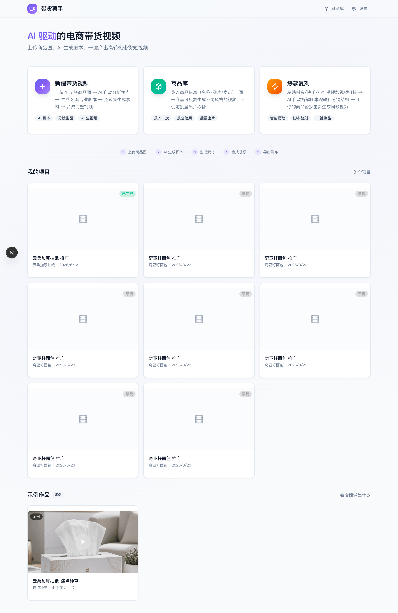
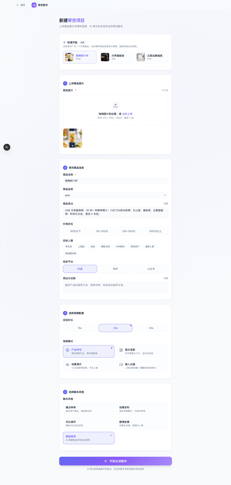
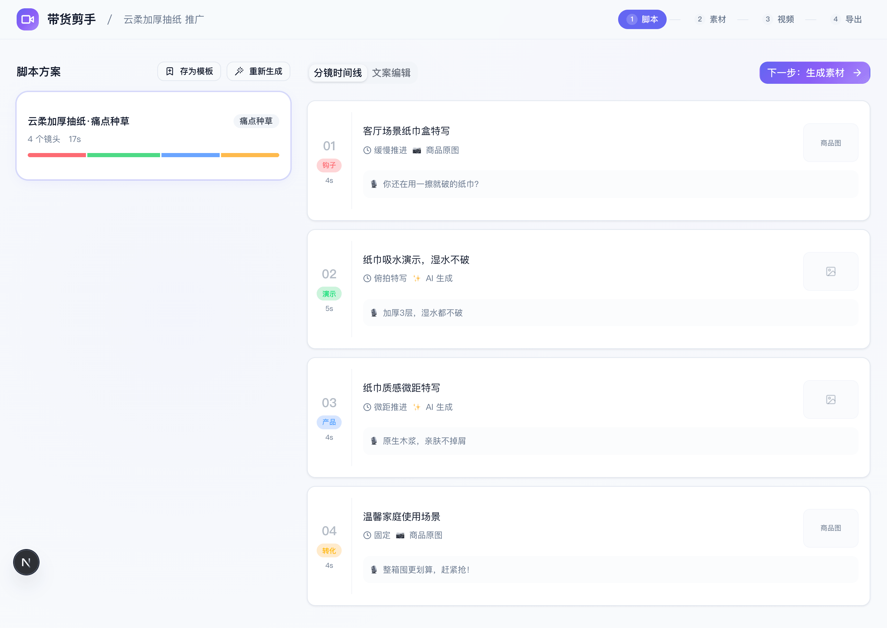
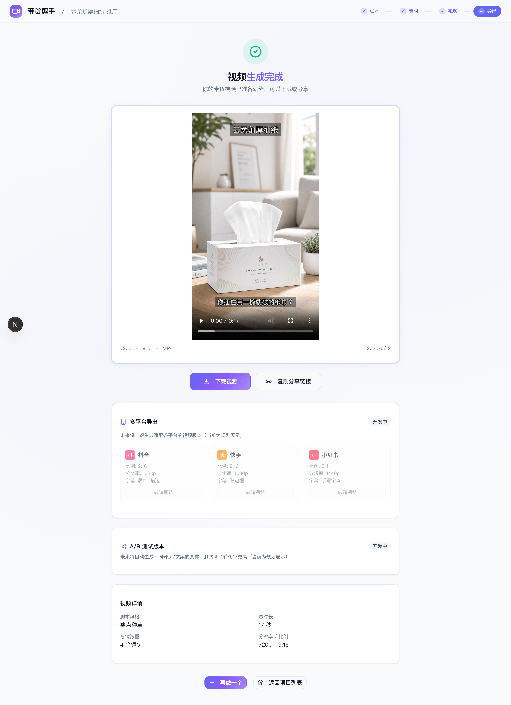
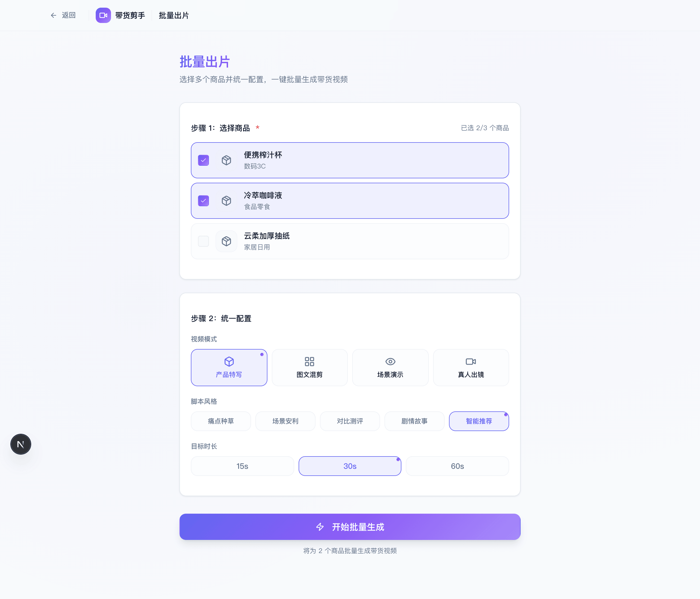
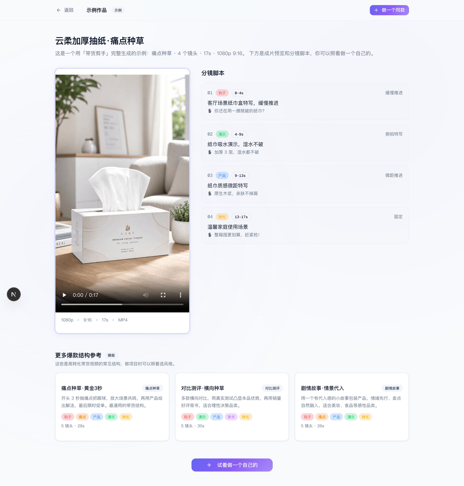

<p align="center"></p>

# ClipForge — 开源 AI 带货短视频神器 ｜ 一张商品图，自动出卖货视频

> **把一张商品图，变成会出单的卖货短视频。** 上传商品图 → AI 提炼卖点 · 写种草脚本 · **锁定商品原图不变形** · 配音 + 字幕 + BGM → 几十秒产出能直接发**抖音小店 / 快手 / 小红书 / TikTok Shop** 的带货视频。**一个人一天出几十条 · 0 成本批量 · 开源无水印。**
>
> <sub>📌 原『**带货剪手** / daihuo-jianshou』，仓库 · Star · 历史全部延续；也支持「一句话主题成片」做任意非带货题材。</sub>

<p align="right"><a href="README.en.md">English</a> · <strong>中文</strong></p>

<p align="center">
  
  
  
  
  
  
  
  
</p>

## 🛍️ 不是又一个 AI 视频工具——它**专为带货而生**

市面上 AI 短视频工具一抓一大把，但大多做不了真正的带货：**不会提炼卖点、不懂平台算法、还会把你的商品改得面目全非**。ClipForge 从第一天就是为**卖货转化**设计的：

- 🎯 **商品保真（带货命门）**：image-to-image 锁定商品原图，换背景 / 打光也**不改商品本体**——绝不把你的产品 P 坏。
- 🧲 **会卖货的脚本**：5 大品类深度模板 × 4 种带货风格（痛点种草 / 场景安利 / 对比测评 / 剧情）+ **黄金 3 秒钩子库**，不是干巴巴念参数。
- 📈 **平台算法适配**：自动产出话题标签 / 封面文案 / 互动引导，贴合**抖音 / 快手 / 小红书**算法与小黄车 / 小店转化。
- 📦 **批量 + 爆款复刻**：大促前选 10 个商品一键批量出片、爆款脚本存模板一键套用、输入竞品链接**换品重拍**、A/B 多版本测转化。

## 🆓 而且，0 成本就能批量出片

- **真·免费、零 Key**：免费素材（Openverse 图 + **Wikimedia 实拍视频**）+ 免费微软 Edge TTS 配音（中 / 英 / 日 / 韩 / 西多语言，出海直接配外文原生发音）+ 免费背景音乐 + 本地 FFmpeg 合成——**没有任何 AI Key 也能出整片**。
- **无水印 · 本地隐私**：自部署、开源（AGPL-3.0），商品图 / 项目 / Key 全在你自己机器，不上传任何云。
- **想要更高画质再加 Key**：一个接口聚合 **7 大**生图/生视频平台、30+ 模型（GPT Image 2 / Seedance 2.0 / Kling 3.0 …）。
- **能被 AI Agent 调用**：内置 **MCP Server**，在 Claude / Cursor 里一句话出片；中英双语界面。

## 🎬 两种玩法（带货为主，也能做任意题材）

- **🛍️ 商品带货成片（主场景）**：**上传商品图，或直接粘贴商品链接一键导入**（自动抓取标题/价/图）→ AI 提炼卖点、写多套带货脚本 → 商品原图保真出镜 + 免费素材配 B-roll → 免费配音 + 字幕 + BGM → 一键导出抖音 / 快手 / 小红书 / TikTok Shop 规格。
- **🗣️ 一句话主题成片**：不卖货也能用——输入一句话主题，AI 写旁白 → 免费素材自动配画面（含免 Key 实拍视频）→ 免费配音 → 合成竖屏成片。
- **✅ 合规 + 转化双开关**：**AIGC 双标识合规**——画面可一键烧「AI 生成」显式标识 + 成片自动写入隐式文件元数据（生成合成标签 / 服务提供者 / 内容制作编号，对齐国标 GB 45438-2025），躲开抖音/快手对「未标识 AI 内容」的自动限流；再加片尾「点击下方小黄车」购买 CTA，发布不违规、看完就下单。脚本侧还**自动预检广告法风险词**（绝对化用语 / 虚假功效 / 医疗用语），命中即在脚本页标注并给修改建议，出片前先躲坑。
- **🛒 商品卡贴片（挂车感）**：可选在画面左下角叠一张商品卡——商品图缩略 + 商品名 + 黄色「点击下方购买 →」引导，开头几秒展示，强化转化。
- **📋 复制即发文案包**：导出页一键生成吸睛标题 + #话题标签 + 种草文案（挂车号召），**没配 AI 也有免 Key 模板版**按品类/平台直接出，复制就能发。

<p align="center"></p>

## 💡 带货实战：一张商品图 → 30 秒一条

以示例「云柔加厚抽纸」为例（成片见下方 [界面预览](#界面预览)）：

1. **传图填名** — 上传商品图、填「云柔加厚抽纸」、选投放平台（抖音 / 快手 / 小红书）。
2. **AI 写脚本（~30s）** — 产出 3 套带货脚本（痛点种草 / 场景安利 / 对比测评），自带黄金 3 秒钩子、话题标签、封面文案、互动引导语。
3. **配画面** — 商品原图**保真出镜** + 免费素材库自动配生活场景 B-roll（不烧 AI Key）。
4. **自动成片** — 自动配音 + 烧中文字幕 + 价格贴 + 背景音乐，FFmpeg 真实合成。
5. **一键导出** — 抖音 9:16 / 小红书 3:4 一键切换，发小店即可卖货。

> 整条**全自动、无水印**；大促前还能选 10 个商品**批量出片**、套用爆款模板、A/B 多版本测转化。

**关键词 / Keywords**: AI 带货短视频 · 带货视频制作 · 电商短视频 · 商品视频生成 · 种草视频 · 抖音小店 / 快手 / 小红书 / TikTok Shop 带货 · AI 卖点提炼 · 商品图转视频 · 批量出片 · 爆款复刻 · faceless UGC ads · product video generator · AI 配音 · 开源自部署 · MCP · GPT Image 2 / Seedance 2.0

---

## 界面预览

| 首页·项目管理 | 一键示例填充 | 分镜脚本 |
|:---:|:---:|:---:|
|  |  |  |
| **成片预览·下载导出** | **批量出片** | **示例作品** |
|  |  |  |

> 示例作品「云柔加厚抽纸」：真实商品图 + 运镜 + 中文字幕 + 价格贴 + 配音，一条带货短视频全自动生成。

<p align="center"></p>

---

## 🆚 做一条带货视频：传统外包 vs ClipForge

| 痛点 | 传统方式 | ClipForge |
|------|---------|---------|
| **脚本创作** | 编导写脚本 1-2 小时 | AI 30 秒生成 3 套脚本 |
| **素材制作** | 拍摄+修图 1-3 天 | AI 生图/生视频，分钟级出片 |
| **视频剪辑** | 剪辑师 2-4 小时 | 自动合成+转场+字幕+配音 |
| **多平台适配** | 手动调整比例/字幕 | 一键导出抖音/快手/小红书版本 |
| **批量出片** | 一天最多 3-5 条 | 选 10 个商品一键批量生成 |
| **成本** | 编导+拍摄+剪辑 数千元/条 | API 调用费 几元/条 |

> 💡 免费路径（免费素材 + 免费配音 + 本地合成）**成本为 0**；只有选用付费 AI 生图 / 生视频模型时才按平台计费（几元/条）。

---

## ❓ 常见问题 FAQ

**ClipForge 是什么？**
ClipForge（原带货剪手 / daihuo-jianshou）是一款**开源免费的 AI 带货短视频工具**：上传一张商品图，AI 自动提炼卖点、写带货脚本、**保持商品原图不变形**、配画面 + 配音 + 字幕，一键产出抖音小店 / 快手 / 小红书 / TikTok Shop 卖货短视频；也支持「一句话主题成片」做任意非带货题材。

**真的完全免费吗？需要 API Key 吗？**
免费路径 **0 Key**：素材用免费可商用 CC 库（Openverse 图片 + Wikimedia 实拍视频），配音用免费微软 Edge TTS，合成用本地 FFmpeg。只有想用付费 AI 生图 / 生视频模型时，才需要对应平台的 Key。

**能做带货 / 电商短视频吗？**
能。上传商品图，AI 自动分析卖点、写多套带货脚本，并**保持商品原图不变形**，一键导出抖音小店 / 快手 / 小红书 / TikTok Shop 规格。

**成片有水印吗？可以商用吗？**
没有水印。自部署 + 开源（AGPL-3.0），成片干净，可商用（第三方素材按其授权使用，导出附带署名 credits）。

**和剪映 / 商业 AI 视频 SaaS 有什么区别？**
ClipForge **开源、本地运行、无水印、免费路径零成本、数据不出本机**；商业 SaaS 通常按条扣费、带水印、需把素材上传云端。

**不会写脚本 / 不会剪辑能用吗？**
能。全流程自动——AI 写脚本、自动配画面、自动配音、自动烧字幕、自动转场，**不用出镜、不用拍摄、不用剪辑**。

**支持哪些平台和语言？**
一键适配抖音 (9:16) / 快手 / 小红书 (3:4) / TikTok / Reels / Shorts；界面与文档支持**中文 / English**，按系统语言自动切换。

**可以让 AI 助手（Claude / Cursor）直接生成视频吗？**
可以。ClipForge 内置 **MCP Server**，在支持 MCP 的客户端里一句话即可驱动出片，详见 [mcp/README.md](mcp/README.md)。

---

## 核心功能

### 一、AI 带货脚本生成

- **5 大品类深度模板**: 美妆护肤 / 食品零食 / 家居日用 / 服饰鞋包 / 数码 3C
- **4 种脚本风格**: 痛点种草 / 场景安利 / 对比测评 / 剧情故事
- **黄金 3 秒策略库**: 视觉冲击法 / 悬念提问法 / 反差对比法 / 利益承诺法 / 情感共鸣法
- **平台 SEO 优化**: 自动生成话题标签、封面文案、互动引导语，适配抖音/快手/小红书算法
- **精准用户定位**: 支持设定目标人群、价格区间、投放平台，脚本自动匹配

### 二、AI 素材生成（多模型聚合）

一个接口聚合 7 大生图/生视频平台 + OpenRouter LLM、30+ 主流模型：

| 平台 | 图片模型 | 视频模型 | 特色 |
|------|---------|---------|------|
| **Atlas Cloud** ⭐推荐 | **GPT Image 2**, Seedream 5.0, Nano Banana 2 | **Seedance 2.0**(原生音频), Kling 3.0, Vidu Q3 | 一个 Key 聚合 LLM+生图+生视频，模型最全价格最优 |
| **fal.ai** | **GPT Image 2**(+edit), FLUX.1/2 Pro, Recraft V4, Seedream V5 Edit | Kling 3.0 Pro, Veo 3, Hailuo 2.3, Luma Ray 2, Vidu Q2 | 模型全，含 OpenAI 生图与商品保真编辑 |
| **Replicate** | FLUX 1.1 Pro/Kontext, Imagen 4, Seedream 4 | Kling v2.1, Seedance 1 Pro, Hailuo 02, Veo 3 Fast | 模型库最全，predictions API 统一调用 |
| **火山引擎（方舟 Ark）** | Seedream 5.0/4.0 | Seedance 2.0/1.0 Pro(原生音频) | 字节系明星模型，电影级画质，速度快 |
| **阿里百炼** | 通义万相 | 万相 2.6/2.5/2.2/2.1 | 商品图生视频效果好 |
| **硅基流动** | Kolors, Qwen-Image | - | 国产高性价比 |
| **OpenAI** | **gpt-image-2**（任意分辨率+图生图编辑）, gpt-image-1.5 | - | 2026 官方旗舰图像模型，文字渲染强、9:16 竖屏直出、商品保真编辑 |

> **LLM（脚本生成）** 走 OpenAI 兼容协议，内置 Atlas Cloud / **OpenRouter**(400+模型) / DeepSeek / Kimi / 智谱 / 豆包 / OpenAI 等一键预设。

### 三、多源免费素材引擎 🆕（不止 AI 生成）

一句英文检索词即可从多个**免费可商用**素材站拉视频/图片/音乐，自动下载落库、留存合规署名——没有商品图、不烧 AI 额度也能为每个分镜配齐画面：

| 素材源 | 免 Key | 媒体 | 说明 |
|--------|:---:|------|------|
| **Openverse** | ✅ | 图片 / 音乐 / 音效 | WordPress 维护，CC 授权，**零配置即用**（新手首选） |
| **Wikimedia Commons** | ✅ | 图片 / **视频** / 音频 | CC/公共领域，**唯一免 Key 的视频源**（取 ≤720p webm 转码）+ 免费 BGM 来源，直链可下 |
| **Pixabay** | 免费 Key | 视频 / 图片 | 实拍 B-roll 主力补充 |
| **Pexels** | 免费 Key | 视频 / 图片 | 高质量可商用 |

- 统一接口 `/api/stock/search`：`source` 指定单源或 `all` **聚合检索**（命中请求媒体类型优先、keyless 源优先、竖屏朝向优先）
- **免 Key 实拍视频 B-roll**：靠 Wikimedia Commons，**无需任何 Key** 就能给分镜配动态视频（`footage:"auto"` 逐镜「视频优先、缺则图片」）
- **免费背景音乐**：合成时可自动加一段 CC 背景音乐（Wikimedia Commons 音频），混在旁白下方自动压低
- 合规留存来源页 / 作者 / 授权（CC 源带现成署名文本），导出可生成 credits；检索词建议英文，召回更好
- **永远有素材兜底**：某检索词查无结果时，自动用更宽泛的回退词重试，生僻主题也不会让某个分镜空画面
- **按分镜自动配素材** `/api/project/[id]/stock-fill`：脚本每镜产出英文检索词后，逐镜从免费库自动拉画面落库（脚本→素材一键配齐）。素材页一键 **「自动配画面（免费素材）」**：topic 成片始终可用；带货项目在**未配生图模型**时也能给钩子/背书等 B-roll 配画面，且**商品原图分镜自动跳过**（保护商品保真）——让没有 AI Key 的用户也能出片
- 注册表式架构，后续可继续接 Coverr / NASA / Freesound 等

### 三-补、一句话主题成片 🆕（无需商品，零门槛闭环）

不卖货也能成片：在首页「一句话主题成片」入口输入一句话主题（如"在家如何泡一杯手冲咖啡"），全程自动：

1. **写脚本** `/api/topic/script`：去商品化的旁白脚本引擎，5 种风格（知识科普 / 情感故事 / 生活方式 / 励志金句 / 旅行风光），每个分镜产出英文检索词
2. **自动配画面** `/api/project/[id]/stock-fill`：逐镜从免费素材库（Openverse 免 Key）拉画面落库，含"永远有素材"兜底。素材页提供一键 **「自动配画面（免费素材）」** 按钮——**无需任何生图 Key** 即可为每个分镜配好真实画面（topic 成片首选路径，已端到端实测 3/3 镜命中 Openverse）
3. **合成成片** `/api/project/[id]/compose`：FFmpeg 把素材配上运镜 + 中文字幕 + **免费 AI 配音**（微软 Edge keyless TTS，无需任何 Key），输出有声竖屏短视频

新建即标记 `contentType=topic`，与带货项目共用后半程素材/合成流程；任何主题都能做，真正"输入一句话 → 产出一条视频"。

### 四、4 种视频模式

| 模式 | 适合商品 | 策略 | 真实感 |
|------|---------|------|--------|
| **产品特写** | 高客单价商品 | 商品原图 + 运动特效，全程不出现 AI 人脸 | 最高 |
| **图文混剪** | 快消品/日用品 | 快节奏商品图 + 文字卡片 + 转场 | 高 |
| **场景演示** | 护肤/厨房/健身 | AI 生成使用场景（手部/背影，避免假脸） | 中高 |
| **真人出镜** | IP 账号 | 角色系统 + 用户上传真人素材 | 取决于素材 |

### 五、视频合成引擎

- **FFmpeg 专业管线**: H.264 High Profile 编码、faststart、256k AAC 音频，真实出片
- **中文字幕烧录**: 自动探测系统中文字体；两种爆款字幕样式——**① rapid 短句卡逐段闪现**（整句切短卡顺序卡点，约 1.2s 一段）；**② 卡拉OK逐字高亮**（整句留屏、逐字随旁白「唱」过去变色，libass 渲染，免 ASR 用自产 TTS 时长对齐）。CJK 按字、英文按词，适配「80% 静音观看」的带货留存（不乱码、不显方块）
- **智能转场**: AI 首尾帧过渡（Seedance 2.0 / Vidu）/ AI 参考过渡（Kling）/ 渐变 / 硬切
- **Ken Burns 运动**: 缓慢推进 / 左右横移 / 景深漂移，用运镜让静态商品图"活起来"且不篡改商品
- **配音双通道**: 付费 OpenAI 兼容 TTS（音质更可控）；或 **免费 Edge keyless TTS**（无需 Key，5 款中文音色可试听）做零配置兜底，逐镜生成口播并按配音时长卡点对齐字幕
- **混源素材归一**: 不同来源素材像素格式/SAR/帧率统一归一，避免 xfade/concat 因格式不一致而合成失败
- **音频智能处理**: 支持音频的模型直接出带配音视频，BGM 自动混音压低

### 六、电商效率工具

| 功能 | 说明 |
|------|------|
| **商品库** | 商品信息录入一次，反复生成不同风格的视频 |
| **批量出片** | 618/双11 大促前，选多个商品**一键批量全成片**——脚本→配画面→合成全自动跑完，直接出成片（免费路径 0 Key），适配 2026「量产变体 A/B 测」打法 |
| **爆款模板** | 跑出数据的脚本存为模板，一键套用到新商品 |
| **爆款复刻** | 输入竞品爆款视频链接，AI 提取脚本逻辑，换品重拍 |
| **品牌设置** | Logo 水印 / 品牌色 / 统一片尾，所有视频风格一致 |
| **人物管理** | 出镜角色跨项目复用，AI 自动保持人物外貌一致 |
| **多平台导出** | 一条视频自动适配抖音(9:16)/快手/小红书(3:4)规格 |
| **A/B 多版本** | 导出页一键把同一条片**重渲成不同字幕风格 + 配乐的变体**（卡拉OK/短句卡 × 欢快/动感），各出一条下载，投放对比哪个转化高（全程免 Key） |

### 七、平台 SEO 优化

脚本自动适配平台算法，每条视频输出完整的 SEO 物料：

```json
{
  "title": "视频标题（含核心关键词）",
  "hashtags": ["#话题标签1", "#话题标签2", "#话题标签3"],
  "coverText": "封面大字文案",
  "interactionGuide": "评论区告诉我你觉得值不值？",
  "description": "视频描述文案（含关键词）"
}
```

- **抖音**: 前3秒强钩子、每5秒信息高点、价格锚点、小黄车引导
- **快手**: 接地气场景、性价比核心、"老铁们"互动话术
- **小红书**: 精致教程感、"先收藏"引导、关键词标题优化

---

## 快速开始

> 本项目用 **pnpm**（已在 `packageManager` 声明）。请勿用 `npm install`——pnpm 的 symlink 结构会让 npm 报错。没有 pnpm：`corepack enable` 或 `npm i -g pnpm`。

```bash
# 克隆项目
git clone https://github.com/xixihhhh/clipforge.git
cd clipforge

# 安装依赖（必须用 pnpm）
pnpm install

# 启动开发服务器
pnpm dev

# 打开浏览器
open http://localhost:3000
```

> 每次 push / PR 由 **GitHub Actions** 自动跑 `lint → test → build`（见 `.github/workflows/ci.yml`），绿了才合入。

### 首次配置

1. 点击右上角 **设置**，配置至少一个 AI 平台的 API Key（推荐 **Atlas Cloud**，一个 Key 同时支持 LLM + 生图 + 生视频）
2. 配置 LLM（脚本生成需要，支持任何 OpenAI 兼容接口）
3. 在"默认设置"里选择默认生图 / 生视频模型（如 GPT Image 2、Seedance 2.0）
4. （可选）在"出镜人物"Tab 添加角色，在"品牌设置"Tab 配置品牌视觉
5. 回到首页，点击 **新建项目** 开始生成

> 视频合成依赖本机 **FFmpeg**（需自行安装：`brew install ffmpeg` / `apt install ffmpeg`）。

---

## 技术架构

```
┌─────────────────────────────────────────────────┐
│  前端 (Next.js 16 + React 19 + Tailwind CSS 4)  │
│  Pages: 首页/一句话主题/商品库/批量出片/新建/脚本/素材/合成/导出/设置 │
└──────────────────┬──────────────────────────────┘
                   │
┌──────────────────▼──────────────────────────────┐
│  API 层 (Next.js Route Handlers)                │
│  /api/llm/script  /api/ai/image  /api/ai/video  │
└──────────────────┬──────────────────────────────┘
                   │
┌──────────────────▼──────────────────────────────┐
│  业务逻辑层                                      │
│  脚本引擎 (Prompt + 模板 + SEO)                   │
│  AI Provider 抽象层 (7 平台 30+ 模型)              │
│  多源素材引擎 (Openverse/Pixabay/Pexels 聚合检索)   │
│  视频合成引擎 (FFmpeg + 转场 + 运动 + 混音)         │
└──────────────────┬──────────────────────────────┘
                   │
┌──────────────────▼──────────────────────────────┐
│  数据层                                          │
│  SQLite + Drizzle ORM / Zustand (前端状态持久化)   │
└─────────────────────────────────────────────────┘
```

| 层级 | 技术 |
|------|------|
| **框架** | Next.js 16 + React 19 |
| **语言** | TypeScript 5 (strict mode) |
| **样式** | Tailwind CSS 4 + shadcn/ui |
| **状态管理** | Zustand (localStorage persist) |
| **数据库** | SQLite + Drizzle ORM（启动自动 migrate，开箱无表也能跑） |
| **视频合成** | FFmpeg (fluent-ffmpeg) |
| **AI 集成** | OpenAI SDK (LLM) + 7 平台生图/生视频 Provider |
| **素材引擎** | 多源版权素材（Openverse 免 Key / Pixabay / Pexels），注册表式聚合检索 |
| **测试** | Vitest (102 用例) + Playwright (E2E) |
| **CI/CD** | GitHub Actions（lint + test + build） |
| **桌面打包** | Electron + electron-builder（Win/Mac，已打通：打包 App 实测可启动 + DB 路由可用） |
| **图标** | react-icons (Lucide 图标集) |

---

## 项目结构

```
src/
├── app/                              # 页面路由
│   ├── page.tsx                      # 首页（项目列表 + 快捷入口）
│   ├── products/                     # 商品库管理
│   ├── batch/                        # 批量出片
│   ├── settings/                     # 设置（AI平台/LLM/人物/品牌 四个Tab）
│   ├── project/
│   │   ├── new/                      # 新建项目（表单 + 视频模式 + 人物 + 模板）
│   │   ├── clone/                    # 爆款复刻
│   │   └── [id]/
│   │       ├── script/               # 脚本编辑（3套方案 + 存为模板）
│   │       ├── assets/               # 素材生成（逐镜头 + 批量）
│   │       ├── video/                # 视频合成（转场 + 配音 + BGM + 字幕）
│   │       └── export/               # 导出（多平台 + A/B版本 + 下载）
│   └── api/                          # API 路由
│
├── lib/
│   ├── providers/                    # AI Provider 抽象层（7平台）+ 多源素材引擎
│   │   ├── stock-types.ts            #   素材候选/下载/源注册表
│   │   ├── openverse.ts pixabay.ts pexels.ts  # 各素材源
│   │   └── stock-registry.ts         #   单源/聚合检索分发
│   ├── script-engine/                # 脚本引擎（Prompt + 模板 + SEO策略）
│   ├── video-composer/               # FFmpeg 合成引擎
│   ├── paths.ts ffmpeg-path.ts       # 可注入路径（支撑 Electron 打包）
│   ├── stores/                       # Zustand 状态管理
│   └── db/                           # SQLite + Drizzle（启动 migrate）
│
├── electron/                         # Electron 主进程 + 打包钩子（进行中）
└── components/ui/                    # shadcn/ui 组件库
```

---

## 支持的 AI 模型（2026.06 官方文档确认）

### 视频生成

| 模型 | 平台 | 音频 | 模式 | 特点 |
|------|------|------|------|------|
| **Seedance 2.0** ⭐ | Atlas Cloud | 原生支持 | T2V / I2V / 参考 / 首尾帧 | 字节最新，原生音频，4-15s，最高 1440p |
| **Kling 3.0 Pro** | fal.ai / Atlas Cloud | 原生支持 | T2V / I2V | 可灵最新，多分镜+人脸绑定 |
| **Veo 3** | fal.ai | 原生支持 | T2V | Google，对话+音效+唇形同步 |
| **Vidu Q3 Pro** | Atlas Cloud | - | T2V / I2V / 首尾帧 | 首尾帧过渡（转场神器） |
| **Hailuo 2.3** | fal.ai | - | T2V / I2V | MiniMax 海螺，运动物理逼真 |
| **Luma Ray 2** | fal.ai | - | T2V / I2V | 真实运动和物理效果 |
| **Seedance 1.5 Pro** | 火山引擎 / Atlas Cloud | - | T2V / I2V | 字节豆包，电影级画质 |
| **万相 2.6** | 阿里百炼 | - | I2V | 商品图生视频效果好 |

### 图片生成

| 模型 | 平台 | 特点 |
|------|------|------|
| **GPT Image 2** ⭐ | Atlas Cloud | OpenAI 最新，任意分辨率，商品图质感好，支持自然语言编辑（换背景/打光/改文字） |
| **Nano Banana 2** | Atlas Cloud | Google，强一致性图像编辑 |
| **FLUX.2 Pro** | fal.ai | 最新一代高质量生图 |
| **Recraft V4 Pro** | fal.ai | 设计风格突出 |
| **Seedream 5.0 Lite** | 火山引擎 / Atlas Cloud | 字节最新，中文优化，支持 edit 锁定主体重绘 |
| **万相** | 阿里百炼 | 商品场景友好 |

> T2V = 文生视频, I2V = 图生视频。支持音频的模型直接输出带配音的视频，不支持的静默输出。
> 带货场景建议优先用 **edit 类模型**（GPT Image 2 / Seedream edit）对商品原图重绘背景，锁定商品主体不被篡改。

---

## 开发

```bash
# 运行测试（102 个用例）
pnpm test

# 代码规范检查
pnpm lint

# 数据库迁移（修改 schema 后生成迁移）
pnpm drizzle-kit generate

# 构建生产版本（含 .next/standalone，供 Electron 打包）
pnpm build

# 打包桌面 App（mac；首次需让 pnpm 装好 electron/ffmpeg 二进制）
pnpm pack:dir   # 出免安装 .app 到 release/（快，验证布局）
pnpm dist       # 出 .dmg 安装包
```

---

## 适用场景

- **电商卖家**: 淘宝/拼多多/抖音小店，快速批量生产商品推广视频
- **短视频运营**: MCN 机构、达人工作室，提升内容产出效率
- **品牌方**: 新品上市快速产出多平台投放素材
- **独立开发者**: 基于此项目二次开发，构建 AI 视频 SaaS

---

## Roadmap

**已完成（带货全链路 + 基建）**
- [x] AI 脚本生成（5 品类 × 4 风格 + 黄金 3 秒 + 平台 SEO）
- [x] 多模型聚合（7 平台 30+ 模型，含 Seedance 2.0 / GPT Image 2 / Kling 3.0）
- [x] 素材生成接入真实模型 + **商品保真**（image-to-image 锁定商品主体）
- [x] 视频合成引擎（FFmpeg，真实出片 + 中文字幕烧录 + 运镜 + textOverlay 价格贴）
- [x] 配音 TTS（OpenAI 兼容）+ BGM 上传混音压低
- [x] 多平台导出真实重编码（抖音 9:16 / 快手 / 小红书 3:4，模糊填充）
- [x] 批量出片（并发池）+ 发布文案生成 + 套用爆款模板
- [x] **CI 流水线**（GitHub Actions：lint / test / build）
- [x] **多源免费素材引擎**（Openverse 免 Key / Pixabay / Pexels，聚合检索 + 合规署名）

**进行中（通用化 + 桌面分发）**
- [x] **品牌升级 ClipForge + 多语言 UI**（零依赖前端国际化，中文默认 / English 一键切换，全站页面国际化；面向全球任意主题，不止带货）
- [x] 无商品「一句话主题成片」闭环（一句话主题→去商品化旁白脚本→英文检索词→免费素材自动配齐→FFmpeg 合成竖屏成片，已端到端实测 13s/720×1280）
- [x] 免费 edge-tts 配音兜底 + 音色试听（零 Key 也能出声）——自研零依赖 keyless Edge TTS 客户端（Node 内置 WebSocket + Sec-MS-GEC 令牌），合成页未配付费 TTS 时默认启用，5 款中文音色可试听，已端到端实测出有声成片
- [x] **Electron 一键桌面包**：mac 打包 App 实测可启动 + DB 路由 200（better-sqlite3 切 Electron ABI、数据落 userData、内置 ffmpeg）。待办：CI 矩阵出 .dmg/.exe 发 Releases + GUI 真机实测
- [x] **渲染质量预设 快速/标准/高清**：一键在出片速度与清晰度/体积间取舍，映射真实 FFmpeg 编码（分辨率 + x264 -preset + -crf，白名单防注入）；合成页选择器，已端到端实测 fast→720p / hd→1080p

**规划（真正的 AI 剪辑能力）**
- [ ] 自动字幕 ASR（whisper / transformers.js）→ 烧录字幕
- [ ] 导入已有视频做剪辑 + 去静音瘦身
- [ ] 长视频切爆款片段（接通爆款复刻的真实视频分析）
- [ ] 数字人口型（fal.ai Lipsync）/ 时间轴编辑 / 多语言配音出海

---

## License

[AGPL-3.0](LICENSE) © 2026 xixihhhh

修改 / 再发布（含 SaaS）须开源并保留署名。

---

<sub><b>关键词 / Keywords</b>：AI 短视频生成工具 · AI 带货短视频 · 一句话成片 · 文字转视频 · text to video · faceless video generator · AI short video maker · 抖音 / 快手 / 小红书 / TikTok / Reels / YouTube Shorts 制作 · AI UGC 电商广告 · AI 配音 / AI voiceover · 免费素材自动剪辑 · 开源 / 自部署视频工具 · AI 脚本生成 · MCP server · ClipForge（原带货剪手 / daihuo-jianshou）。</sub>

<sub>ClipForge 是独立开源项目，与抖音、快手、小红书、TikTok、YouTube、Shopify、Amazon、Microsoft、OpenAI 及任何模型供应商无官方关联；使用第三方模型与素材请遵守其各自条款。</sub>
